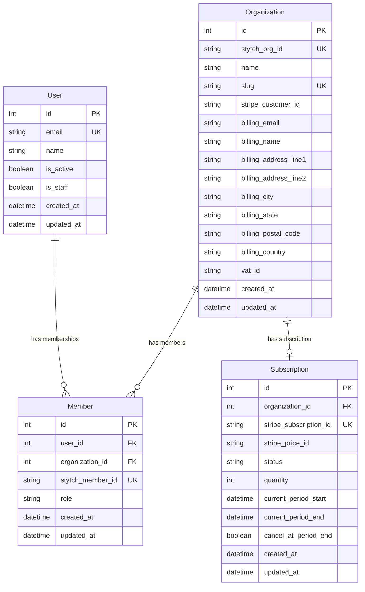

# Data Models

## Entity Relationship Diagram

## Models Detail

### User
Cross-organization identity. A user can be a member of multiple organizations.

| Field | Type | Description |
|-------|------|-------------|
| `email` | EmailField | Unique identifier, synced from Stytch |
| `name` | CharField | Display name |
| `is_active` | BooleanField | Account active status |
| `is_staff` | BooleanField | Django admin access |

### Organization
Tenant/workspace. Each organization has its own members, settings, and subscription.

| Field | Type | Description |
|-------|------|-------------|
| `stytch_org_id` | CharField | Stytch organization ID |
| `name` | CharField | Organization display name |
| `slug` | SlugField | URL-safe identifier |
| `stripe_customer_id` | CharField | Stripe customer for billing |
| `billing_*` | Various | Billing address fields |
| `vat_id` | CharField | EU VAT number |

### Member
Tracks a user's membership in an organization with role-based access.

| Field | Type | Description |
|-------|------|-------------|
| `user` | ForeignKey | References User |
| `organization` | ForeignKey | References Organization |
| `stytch_member_id` | CharField | Stytch member ID |
| `role` | CharField | `admin`, `member`, or `viewer` |

**Properties:**
- `is_admin` — Returns `True` if role is `"admin"`

### Subscription
Tracks Stripe subscription state for an organization.

| Field | Type | Description |
|-------|------|-------------|
| `organization` | OneToOneField | Organization being billed |
| `stripe_subscription_id` | CharField | Stripe subscription ID |
| `stripe_price_id` | CharField | Stripe price/plan ID |
| `status` | CharField | Subscription status (see below) |
| `quantity` | PositiveIntegerField | Number of seats |
| `current_period_start` | DateTimeField | Billing period start |
| `current_period_end` | DateTimeField | Billing period end |
| `cancel_at_period_end` | BooleanField | Pending cancellation |

**Status Values:**
- `active` — Subscription is paid and usable
- `trialing` — In trial period
- `past_due` — Payment failed, grace period
- `canceled` — Subscription ended
- `incomplete` — Initial payment pending
- `incomplete_expired` — Initial payment failed
- `unpaid` — Multiple payment failures
- `paused` — Temporarily paused

**Properties:**
- `is_active` — Returns `True` if status is `active` or `trialing`

## Sync Strategy

### Stytch → Django
- **User/Member/Organization** synced during auth flows
- Data is replicated for local querying
- Stytch remains source of truth

### Django → Stripe
- **Customer** created when org upgrades
- **Billing info** synced on updates
- **Subscription quantity** synced with member count
