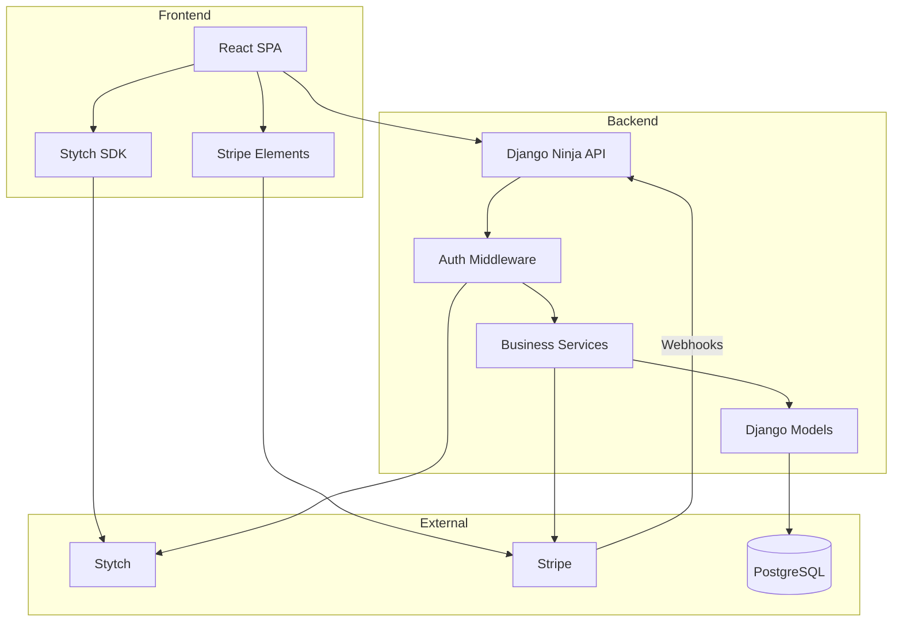
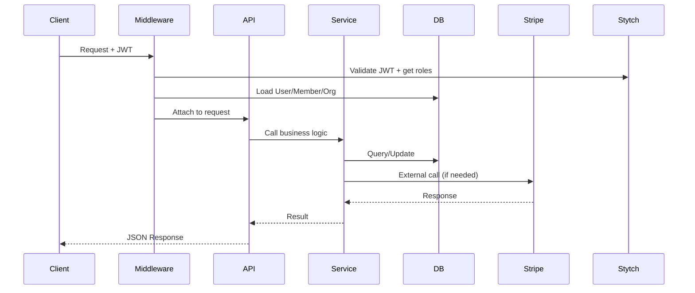
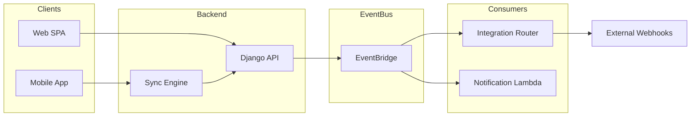

# System Architecture Overview

## Tech Stack

| Layer | Technology | Purpose |
|-------|------------|---------|
| **Backend** | Django 6.0 + Django Ninja | REST API with OpenAPI spec |
| **Frontend** | Vite + React 19 + TypeScript | SPA with server state management |
| **Auth** | Stytch B2B | Enterprise-ready authentication |
| **Billing** | Stripe | Subscriptions with per-seat pricing |
| **Database** | PostgreSQL 16 | Primary data store |
| **Infra** | AWS CDK | Infrastructure as code |

## High-Level Architecture



## Application Structure

```
backend/
├── apps/
│   ├── accounts/      # User, Member models + auth API
│   ├── organizations/ # Organization model + multi-tenancy
│   ├── billing/       # Stripe subscriptions
│   ├── media/         # Image uploads, SVG sanitization
│   └── core/          # Security, middleware, shared utilities
├── config/
│   ├── api.py         # API router setup
│   ├── urls.py        # URL routing
│   └── settings/      # Environment-specific settings
└── tests/             # Pytest test suites

frontend/
├── src/
│   ├── components/    # Reusable UI components
│   ├── features/      # Feature-specific code
│   ├── hooks/         # Custom React hooks
│   ├── lib/           # API client, utilities
│   └── pages/         # Route components
└── public/            # Static assets
```

## Design Principles

### 1. Stytch as Auth Source of Truth
Stytch owns user identity, organizations, and member roles. Local Django models sync from Stytch via:
- **Just-in-time sync** during authentication
- **Webhooks** for out-of-band changes (future)

### 2. Stripe as Billing Source of Truth
Stripe owns subscription state. Local models track:
- Subscription ID and status
- Period dates for UI display
- Webhooks sync state changes

### 3. Thin Controllers, Rich Services
- API endpoints handle request/response only
- Business logic lives in service functions
- Services are testable with mocked dependencies

### 4. External Calls Outside Transactions
- Never call Stripe/Stytch inside `atomic()` blocks
- Use `transaction.on_commit()` for post-commit events
- Webhook handlers are idempotent

## Request Flow



## Event-Driven Architecture

The bootstrap includes an event-driven spine for async workflows, integrations, and offline-first mobile sync.



### Key Components

| Component | Purpose | Details |
|-----------|---------|---------|
| **Event Model** | Standardized event structure | [events.md](./events.md) |
| **Sync Engine** | Offline-first mobile/desktop sync | [sync.md](./sync.md) |
| **Integration Router** | Outbound webhooks to external systems | [integrations.md](./integrations.md) |

### Design Decisions

- **Django as gatekeeper**: Mobile sync flows through Django for auth and validation
- **EventBridge as fan-out**: Single event bus distributes events to consumers
- **Public events for integrations**: Curated subset of internal events exposed to customers
- **Idempotency everywhere**: All handlers tolerate duplicates and replays

---

## Scaling Considerations

The default configuration is optimized for cost and simplicity. For high-volume production workloads, consider these enhancements:

### Database Connections

| Approach | When to Use | Trade-offs |
|----------|-------------|------------|
| **Direct connections** (default) | Low-to-moderate Lambda concurrency (<50) | Simple, Aurora Serverless v2 handles well |
| **RDS Proxy** | High Lambda concurrency (>50 concurrent) | Adds ~$0.015/vCPU-hour, prevents connection exhaustion |
| **Aurora Data API** | Very high Lambda volume, no persistent connections needed | HTTP-based, slight latency overhead |

### Event Publishing

- **Publisher Lambda concurrency**: Limited to 5 by default to prevent DB overload
- **Dead Letter Queue**: Failed events retained 14 days for investigation
- **CloudWatch schedule**: 1-minute fallback polling if Aurora triggers fail

### Image Transformation

- **Lambda memory**: Set to 1024MB for Sharp processing; increase for large images
- **CloudFront caching**: Transformed images cached at edge (1-year max-age)
- **CDN price class**: Currently using PRICE_CLASS_100 (US/Canada/Europe); expand for global audience

---

## Related Documents

| Document | Description |
|----------|-------------|
| [Data Models](./data-models.md) | Entity relationships and model details |
| [Events](./events.md) | Event architecture, naming, schema versioning |
| [Sync](./sync.md) | Offline-first sync engine for mobile/desktop |
| [Integrations](./integrations.md) | Webhook delivery and external integrations |
