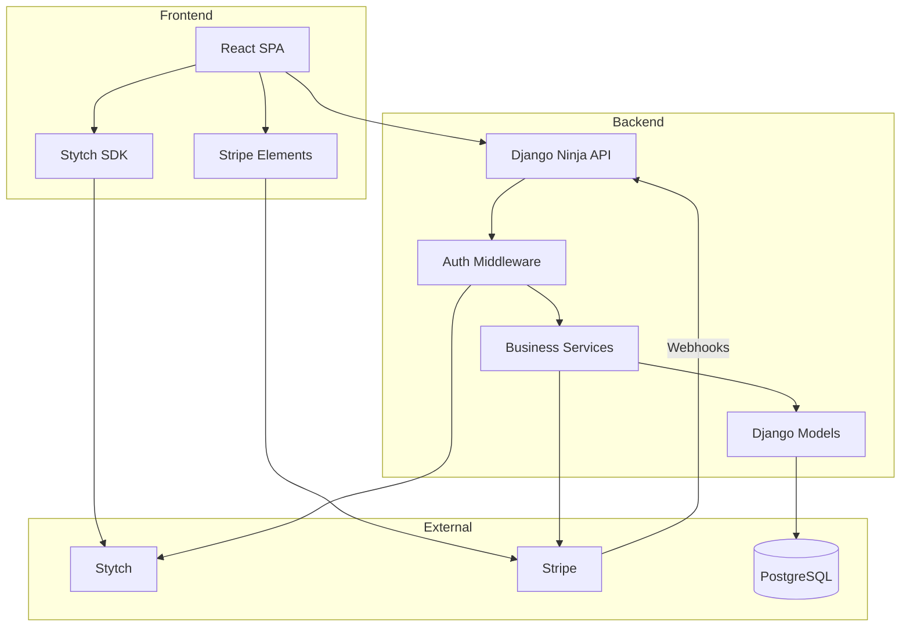
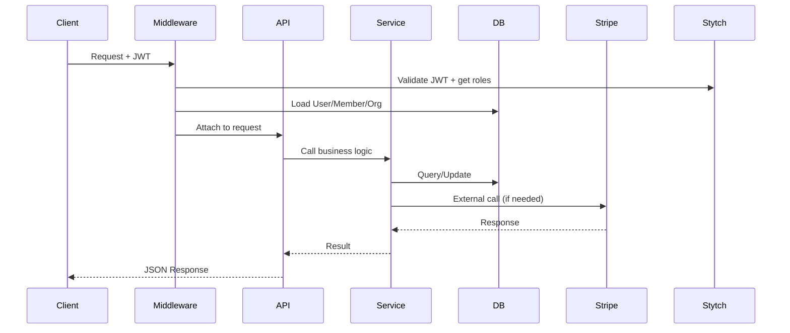

# System Architecture Overview

## Tech Stack

| Layer | Technology | Purpose |
|-------|------------|---------|
| **Backend** | Django 6.0 + Django Ninja | REST API with OpenAPI spec |
| **Frontend** | Vite + React 19 + TypeScript | SPA with server state management |
| **Auth** | Stytch B2B | Enterprise-ready authentication |
| **Billing** | Stripe | Subscriptions with per-seat pricing |
| **Database** | PostgreSQL 16 | Primary data store |
| **Infra** | AWS CDK | Infrastructure as code |

## High-Level Architecture



## Application Structure

```
backend/
├── apps/
│   ├── accounts/      # User, Member models + auth API
│   ├── organizations/ # Organization model + multi-tenancy
│   ├── billing/       # Stripe subscriptions
│   ├── media/         # Image uploads, SVG sanitization
│   └── core/          # Security, middleware, shared utilities
├── config/
│   ├── api.py         # API router setup
│   ├── urls.py        # URL routing
│   └── settings/      # Environment-specific settings
└── tests/             # Pytest test suites

frontend/
├── src/
│   ├── components/    # Reusable UI components
│   ├── features/      # Feature-specific code
│   ├── hooks/         # Custom React hooks
│   ├── lib/           # API client, utilities
│   └── pages/         # Route components
└── public/            # Static assets
```

## Design Principles

### 1. Stytch as Auth Source of Truth
Stytch owns user identity, organizations, and member roles. Local Django models sync from Stytch via:
- **Just-in-time sync** during authentication
- **Webhooks** for out-of-band changes (future)

### 2. Stripe as Billing Source of Truth
Stripe owns subscription state. Local models track:
- Subscription ID and status
- Period dates for UI display
- Webhooks sync state changes

### 3. Thin Controllers, Rich Services
- API endpoints handle request/response only
- Business logic lives in service functions
- Services are testable with mocked dependencies

### 4. External Calls Outside Transactions
- Never call Stripe/Stytch inside `atomic()` blocks
- Use `transaction.on_commit()` for post-commit events
- Webhook handlers are idempotent

## Request Flow


