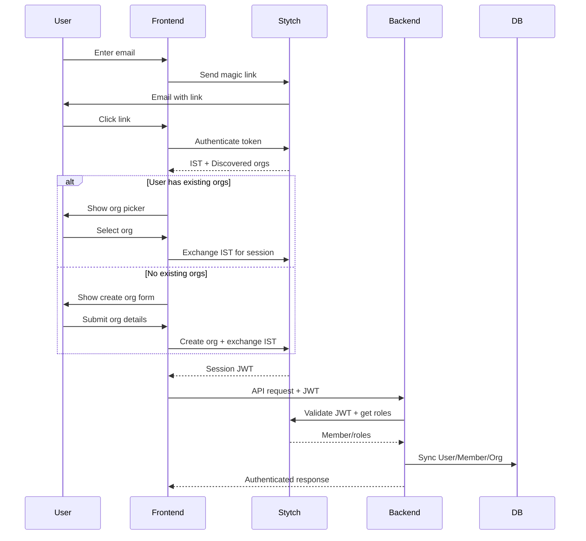
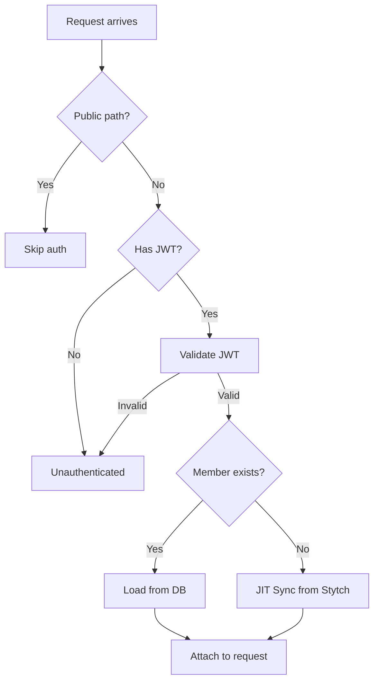

# Authentication

## Overview

Authentication is handled by [Stytch B2B](https://stytch.com/b2b):
- Magic link email authentication
- Google OAuth sign-in
- Organization discovery (multi-org access)
- Role-based access control
- SSO and SCIM ready

## Authentication Flow



> **Note:** JWT validation uses Stytch API (not local JWKS) to ensure role changes reflect immediately.

## Key Concepts

| Term | Description |
|------|-------------|
| **IST** | Intermediate Session Token — temporary token before org selection |
| **Session JWT** | Full authentication token after org selection |
| **Discovery** | Finding all orgs a user can access |
| **Exchange** | Converting IST to session by selecting an org |

## JWT Middleware Flow



**Public Paths:** `/api/v1/auth/magic-link/*`, `/api/v1/health`, `/admin/*`, `/webhooks/stripe/`

## Role-Based Access

Roles synced from Stytch:

| Role | Permissions |
|------|-------------|
| `admin` | Full org management, billing, members |
| `member` | Standard access |
| `viewer` | Read-only |

## Frontend Integration

```typescript
const stytch = useStytchB2BClient();
const { session_jwt } = stytch.session.getTokens();

// Use in API requests
fetch("/api/v1/...", {
  headers: { Authorization: `Bearer ${session_jwt}` },
});
```

## Webhooks

Stytch webhooks provide real-time synchronization when changes occur outside authentication:

| Event | Action |
|-------|--------|
| `*.member.update` | Sync role changes, status updates |
| `*.member.delete` | Soft delete local member |
| `*.organization.update` | Sync name, slug, logo changes |

### Setup

1. Configure webhook endpoint in Stytch Dashboard: `https://yourapp.com/webhooks/stytch/`
2. Copy the signing secret to `STYTCH_WEBHOOK_SECRET` environment variable
3. Enable events: `member.update`, `member.delete`, `organization.update`

> **Note:** Webhooks use Svix for delivery with automatic retries and signature verification.

## Google OAuth

Optional Google sign-in alongside magic links.

### Setup

**Google Cloud Console:**

1. Go to [Google Cloud Console](https://console.cloud.google.com) → **APIs & Services** → **Credentials**
2. Create **OAuth Client ID** (Web Application)
3. Add authorized redirect URI from Stytch Dashboard (under OAuth → Google)
4. Set OAuth consent screen **User type** to **External** (or Internal for Workspace-only)

**Stytch Dashboard:**

1. Go to **Authentication** → **OAuth** → **Google**
2. Enable Google and paste Client ID + Secret

### Directory API (Coworker Suggestions)

When inviting members, suggestions from the user's Google Workspace directory can appear.

**Additional Setup:**

1. Enable **Admin SDK API** in Google Cloud Console
2. Add OAuth scope: `https://www.googleapis.com/auth/admin.directory.user.readonly`
3. Users must re-authenticate to grant the new scope

> **Note:** Only works for Google Workspace accounts. Personal Gmail users see no suggestions (graceful degradation).
