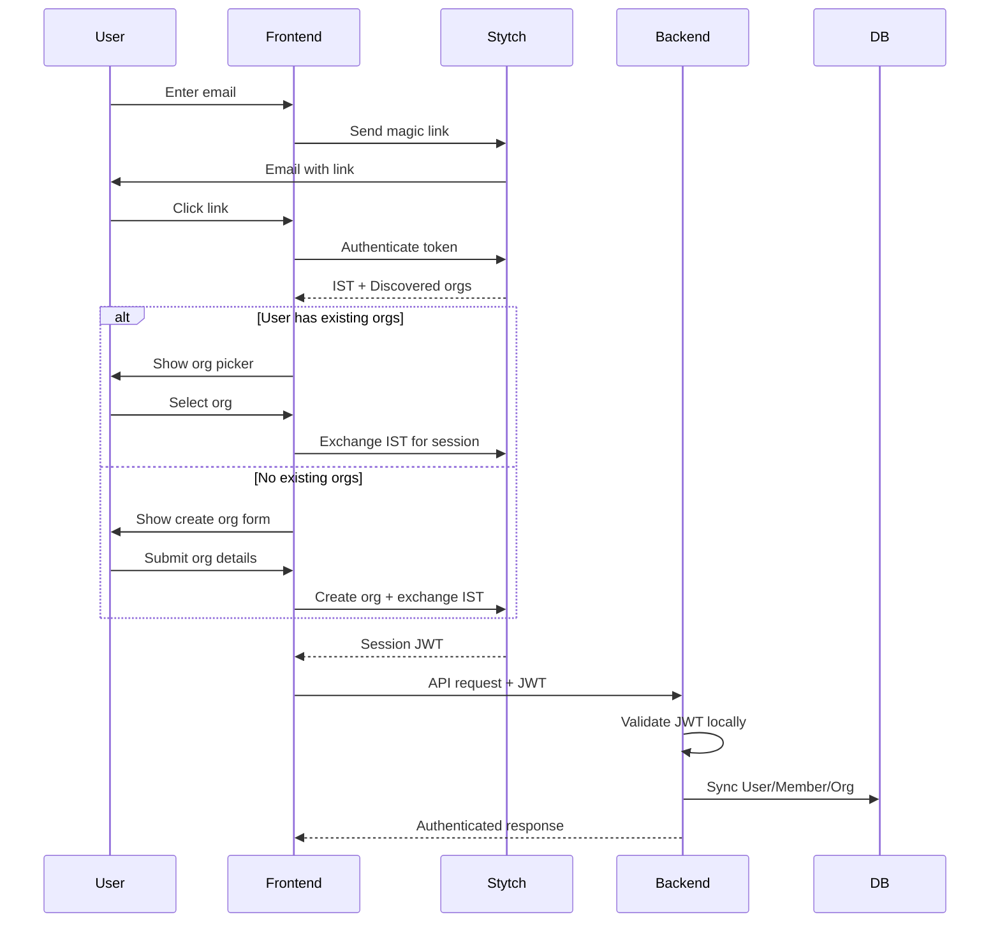
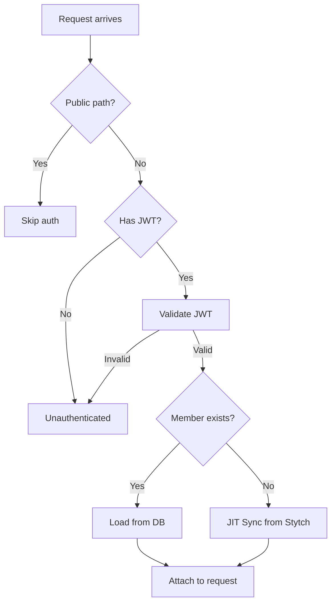

# Authentication

## Overview

Authentication is handled by [Stytch B2B](https://stytch.com/b2b):
- Magic link email authentication
- Organization discovery (multi-org access)
- Role-based access control
- SSO and SCIM ready

## Authentication Flow



## Key Concepts

| Term | Description |
|------|-------------|
| **IST** | Intermediate Session Token — temporary token before org selection |
| **Session JWT** | Full authentication token after org selection |
| **Discovery** | Finding all orgs a user can access |
| **Exchange** | Converting IST to session by selecting an org |

## JWT Middleware Flow



**Public Paths:** `/api/v1/auth/magic-link/*`, `/api/v1/health`, `/admin/*`, `/webhooks/stripe/`

## Role-Based Access

Roles synced from Stytch:

| Role | Permissions |
|------|-------------|
| `admin` | Full org management, billing, members |
| `member` | Standard access |
| `viewer` | Read-only |

## Frontend Integration

```typescript
const stytch = useStytchB2BClient();
const { session_jwt } = stytch.session.getTokens();

// Use in API requests
fetch("/api/v1/...", {
  headers: { Authorization: `Bearer ${session_jwt}` },
});
```
