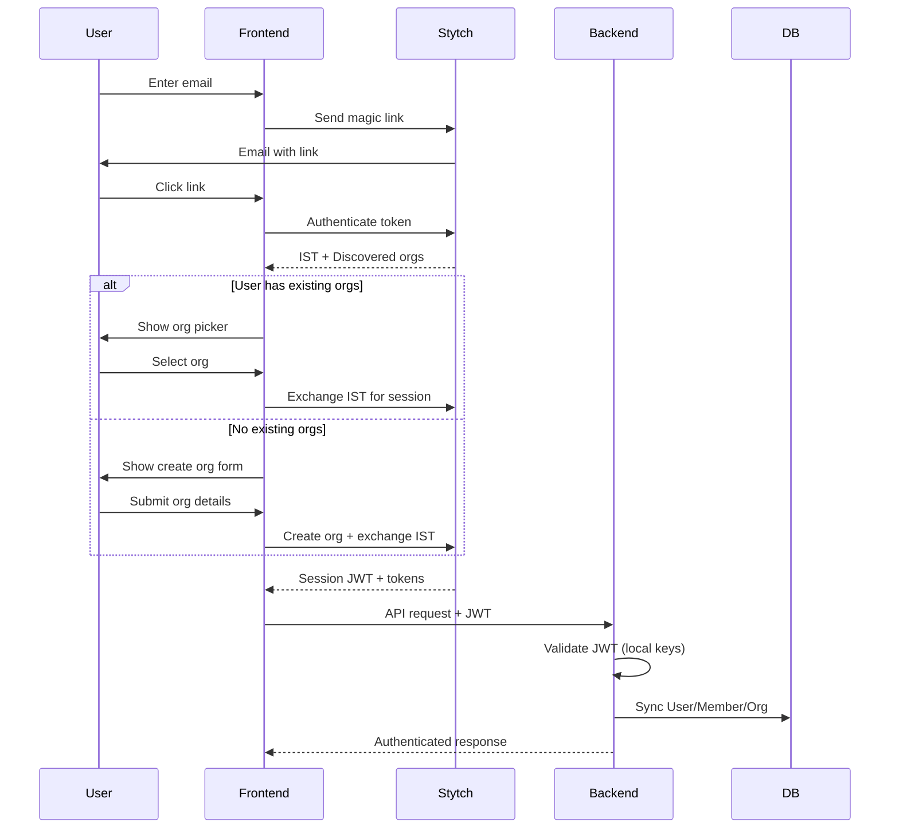
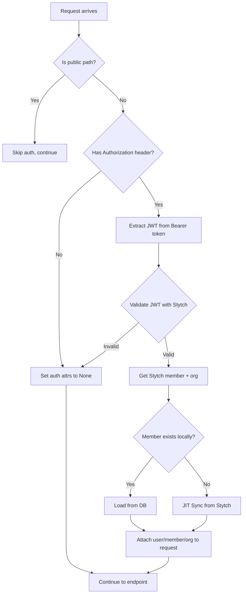

# Authentication

## Overview

Authentication is handled by [Stytch B2B](https://stytch.com/b2b), providing enterprise-ready features:
- Magic link email authentication
- Organization discovery (multi-org access)
- Role-based access control
- SSO and SCIM ready (configuration only)

## Authentication Flow

### Magic Link Discovery Flow



### Key Concepts

| Term | Description |
|------|-------------|
| **IST** | Intermediate Session Token - temporary token before org selection |
| **Session JWT** | Full authentication token after org selection |
| **Discovery** | Process of finding orgs a user can access |
| **Exchange** | Converting IST to session by selecting an org |

## JWT Authentication Middleware

Every API request (except public paths) goes through JWT validation:



**Public Paths:**
- `/api/v1/auth/magic-link/*` — Login initiation
- `/api/v1/health` — Health check
- `/admin/*` — Django admin
- `/webhooks/stripe/` — Stripe webhooks

## API Endpoints

### Send Magic Link
```
POST /api/v1/auth/magic-link/send
```
Triggers magic link email for passwordless login.

**Request:**
```json
{ "email": "user@example.com" }
```

### Authenticate Magic Link
```
POST /api/v1/auth/magic-link/authenticate
```
Validates the magic link token, returns discovered organizations.

**Request:**
```json
{ "token": "magic_link_token_from_email" }
```

**Response:**
```json
{
  "intermediate_session_token": "ist_xxx",
  "email": "user@example.com",
  "discovered_organizations": [
    {
      "organization_id": "org-xxx",
      "organization_name": "Acme Corp",
      "organization_slug": "acme"
    }
  ]
}
```

### Create Organization
```
POST /api/v1/auth/discovery/create-org
```
Creates a new organization and authenticates the user as admin.

**Request:**
```json
{
  "intermediate_session_token": "ist_xxx",
  "organization_name": "New Corp",
  "organization_slug": "new-corp"
}
```

### Exchange Session
```
POST /api/v1/auth/discovery/exchange
```
Exchanges IST for a full session by selecting an existing organization.

**Request:**
```json
{
  "intermediate_session_token": "ist_xxx",
  "organization_id": "org-xxx"
}
```

### Get Current User
```
GET /api/v1/auth/me
```
Returns authenticated user, member, and organization info.

**Requires:** Valid session JWT

### Logout
```
POST /api/v1/auth/logout
```
Revokes the current session.

**Requires:** Valid session JWT

## Frontend Integration

The frontend uses `@stytch/react` SDK:

```typescript
import { useStytchB2BClient } from "@stytch/react/b2b";

// Get session tokens for API calls
const stytch = useStytchB2BClient();
const { session_jwt } = stytch.session.getTokens();

// Use in API requests
fetch("/api/v1/auth/me", {
  headers: {
    Authorization: `Bearer ${session_jwt}`,
  },
});
```

## Role-Based Access

Roles are synced from Stytch:

| Role | Permissions |
|------|-------------|
| `admin` | Full org management, billing, member management |
| `member` | Standard access, no org settings |
| `viewer` | Read-only access |

Admin check in endpoints:
```python
if not request.auth_member.is_admin:
    raise HttpError(403, "Admin access required")
```
