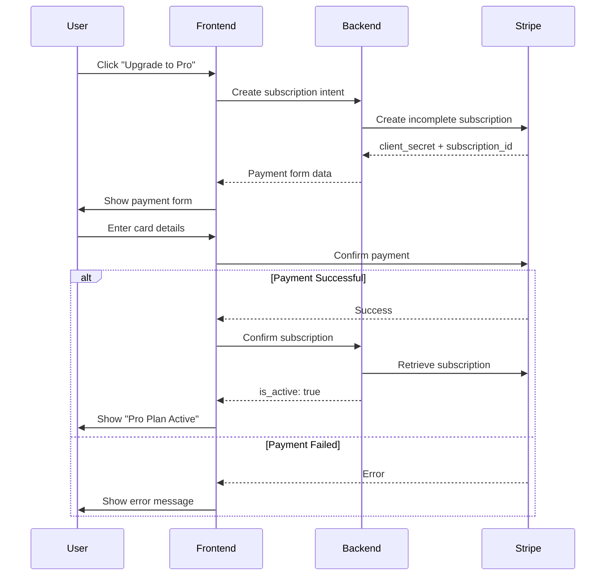
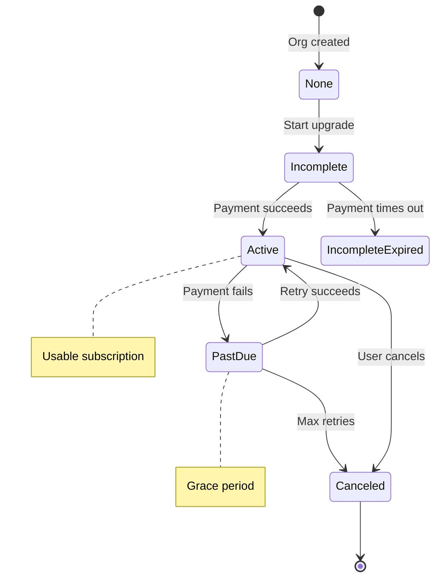
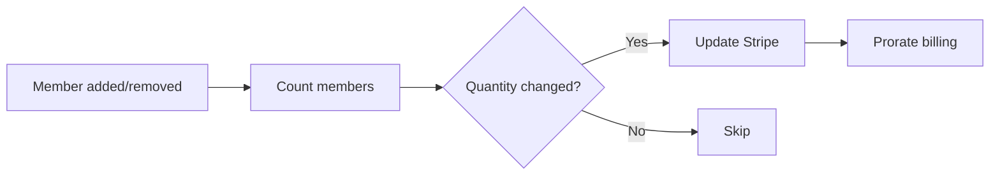

# Billing & Payments

## Overview

Billing is handled by [Stripe](https://stripe.com) with per-seat subscription pricing:
- In-app payment via Stripe Elements
- Seat-based pricing with automatic quantity sync
- Self-service via Stripe Customer Portal
- Webhook-based state synchronization

## Payment Flow

## Subscription Lifecycle

## Subscription States

| Status | Usable? | Description |
|--------|---------|-------------|
| `active` | ✅ | Paid and usable |
| `trialing` | ✅ | In trial period |
| `past_due` | ❌ | Payment failed, grace period |
| `canceled` | ❌ | Subscription ended |
| `incomplete` | ❌ | Initial payment pending |

## Seat-Based Pricing

Subscription quantity syncs with organization member count:

**Rules:**
- Quantity updates use proration
- Only syncs for active subscriptions
- Minimum quantity is 1

## Webhook Events

| Event | Action |
|-------|--------|
| `customer.subscription.created` | Create local subscription |
| `customer.subscription.updated` | Update status/quantity |
| `customer.subscription.deleted` | Mark as canceled |
| `invoice.payment_failed` | Log failure |

## Invoice History

Admins can view past invoices directly in the Billing Settings page. Invoices are fetched from Stripe and include:

- Invoice number and status (Paid, Open, etc.)
- Amount and currency
- Date issued
- Links to view online or download PDF

Pagination is supported for organizations with many invoices.

## Development Without Webhooks

The `confirm-subscription` endpoint allows syncing status directly from Stripe, bypassing webhooks for local development.

> **Production:** Always configure webhooks at `/webhooks/stripe/` for reliability.
