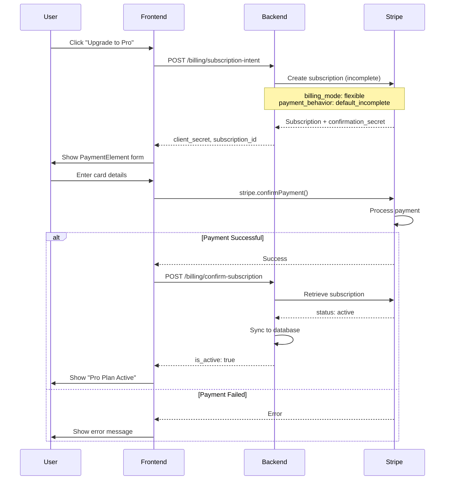
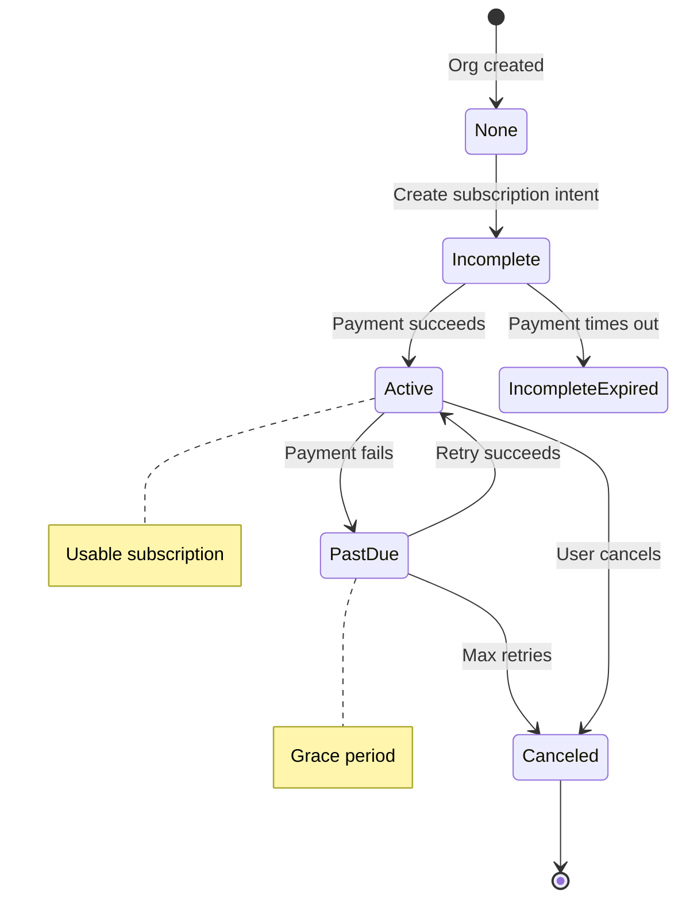
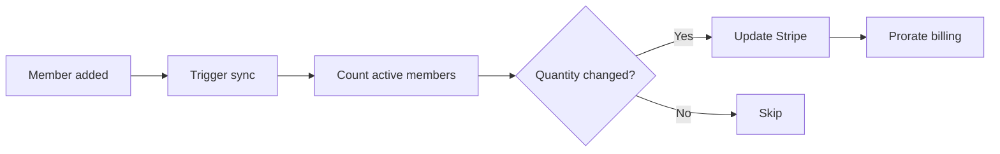
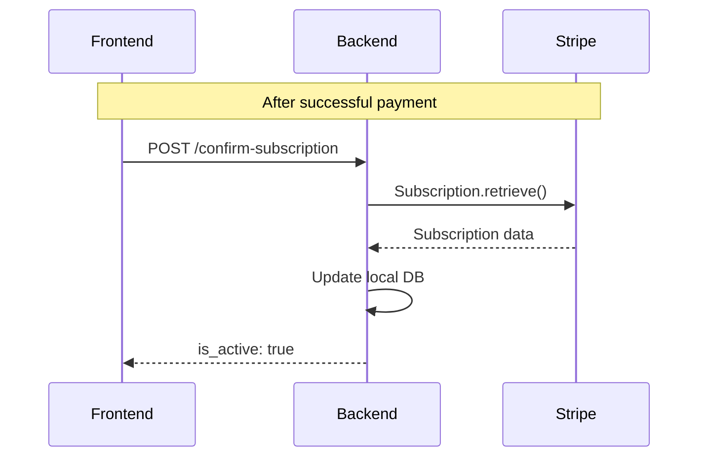

# Billing & Payments

## Overview

Billing is handled by [Stripe](https://stripe.com) with per-seat subscription pricing. The system supports:
- Subscription upgrades with in-app payment (Stripe Elements)
- Seat-based pricing with automatic quantity sync
- Customer billing portal for self-service
- Webhook-based state synchronization

## Payment Flow

### Upgrade Flow (Stripe Elements)



### Subscription Lifecycle



## Subscription States

| Status | `is_active` | Description |
|--------|-------------|-------------|
| `active` | ✅ | Paid and usable |
| `trialing` | ✅ | In trial period |
| `past_due` | ❌ | Payment failed, grace period |
| `canceled` | ❌ | Subscription ended |
| `incomplete` | ❌ | Initial payment pending |
| `incomplete_expired` | ❌ | Initial payment failed |
| `unpaid` | ❌ | Multiple payment failures |
| `paused` | ❌ | Temporarily paused |

## API Endpoints

### Get Subscription
```
GET /api/v1/billing/subscription
```
Returns current subscription status.

**Requires:** Valid session JWT

**Response (subscribed):**
```json
{
  "status": "active",
  "quantity": 5,
  "current_period_end": "2024-02-01T00:00:00Z",
  "cancel_at_period_end": false
}
```

**Response (free tier):**
```json
{
  "status": "none",
  "quantity": 3,
  "current_period_end": null,
  "cancel_at_period_end": false
}
```

### Create Subscription Intent
```
POST /api/v1/billing/subscription-intent
```
Creates a subscription for in-app payment with Stripe Elements.

**Requires:** Admin role

**Request:**
```json
{
  "quantity": 5
}
```

**Response:**
```json
{
  "client_secret": "pi_xxx_secret_xxx",
  "subscription_id": "sub_xxx"
}
```

### Confirm Subscription
```
POST /api/v1/billing/confirm-subscription
```
Syncs subscription status from Stripe after payment. Useful for development without webhooks.

**Requires:** Admin role

**Request:**
```json
{
  "subscription_id": "sub_xxx"
}
```

**Response:**
```json
{
  "is_active": true
}
```

### Create Checkout Session
```
POST /api/v1/billing/checkout
```
Creates a Stripe Checkout session (redirect-based flow).

**Requires:** Admin role

**Request:**
```json
{
  "success_url": "https://app.example.com/billing?success=true",
  "cancel_url": "https://app.example.com/billing",
  "quantity": 5
}
```

### Create Portal Session
```
POST /api/v1/billing/portal
```
Creates a Stripe Customer Portal session for self-service billing management.

**Requires:** Admin role, existing subscription

**Request:**
```json
{
  "return_url": "https://app.example.com/billing"
}
```

## Webhook Events

The system handles these Stripe webhook events:

| Event | Handler |
|-------|---------|
| `checkout.session.completed` | Create subscription record |
| `customer.subscription.created` | Create/update subscription |
| `customer.subscription.updated` | Update subscription status |
| `customer.subscription.deleted` | Mark as canceled |
| `invoice.paid` | Log successful payment |
| `invoice.payment_failed` | Log failure, may trigger alerts |

### Webhook Security

```python
# Signature verification
stripe.Webhook.construct_event(
    payload=request.body,
    sig_header=request.headers["Stripe-Signature"],
    secret=settings.STRIPE_WEBHOOK_SECRET,
)
```

## Seat-Based Pricing

Subscription quantity syncs with organization member count:



**Sync Rules:**
- Quantity updates use proration
- Only syncs for active subscriptions
- Minimum quantity is 1

## Development Without Webhooks

For local development, the `confirm-subscription` endpoint allows syncing subscription status without running `stripe listen`:



> **Production Note:** Always configure webhooks in production for reliability. The confirm endpoint is a development convenience.

## Stripe Configuration

### Environment Variables

```env
# backend/.env
STRIPE_SECRET_KEY=sk_test_xxx
STRIPE_WEBHOOK_SECRET=whsec_xxx
STRIPE_PRICE_ID=price_xxx
```

### Setup Script

```bash
# Create product and price in Stripe
uv run python manage.py setup_stripe
```

This creates:
- Product: "Pro Plan"
- Price: $10/seat/month (or configured amount)

## Frontend Integration

### PaymentForm Component

Uses `@stripe/react-stripe-js` with PaymentElement:

```tsx
import { PaymentElement } from "@stripe/react-stripe-js";

function PaymentForm({ clientSecret, onSuccess }) {
  const stripe = useStripe();
  const elements = useElements();

  const handleSubmit = async () => {
    const { error } = await stripe.confirmPayment({
      elements,
      redirect: "if_required",
    });
    
    if (!error) {
      // Sync subscription status
      await api.confirmSubscription({ subscription_id });
      onSuccess();
    }
  };

  return (
    <form onSubmit={handleSubmit}>
      <PaymentElement />
      <button type="submit">Subscribe</button>
    </form>
  );
}
```
