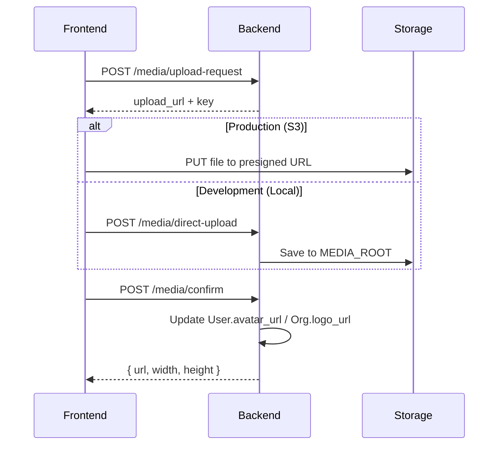

# Media Uploads

## Overview

Image uploads for user avatars and organization logos. Uses local filesystem in development and S3 in production.

## Upload Flow



## Configuration

**Backend** (`config/settings/base.py`):
```python
# Upload limits
MEDIA_MAX_IMAGE_SIZE_BYTES = 10 * 1024 * 1024  # 10MB
MEDIA_ALLOWED_IMAGE_TYPES = [
    "image/jpeg", "image/png", "image/webp",
    "image/svg+xml", "image/avif",
]

# Storage backend (set via environment variables in production)
USE_S3_STORAGE = False  # Set True in production
AWS_STORAGE_BUCKET_NAME = ""  # S3 bucket name
AWS_S3_REGION_NAME = "us-east-1"
AWS_S3_CUSTOM_DOMAIN = ""  # CloudFront domain for CDN
IMAGE_TRANSFORM_URL = ""  # URL for on-the-fly image resizing
```

**Production Environment** (auto-configured by CDK):

| Variable | Description |
|----------|-------------|
| `USE_S3_STORAGE` | `true` when media bucket is configured |
| `AWS_STORAGE_BUCKET_NAME` | S3 bucket from `TangoMedia` stack |
| `AWS_S3_REGION_NAME` | AWS region |
| `AWS_S3_CUSTOM_DOMAIN` | CloudFront distribution domain |
| `IMAGE_TRANSFORM_URL` | CloudFront URL for Lambda@Edge image transformation |

> [!NOTE]
> In production on Fargate, S3 credentials are obtained from the task's IAM role - no explicit keys needed.

### SVG Security

SVG files are sanitized before storage to prevent XSS attacks:

- Whitelist-based element/attribute filtering
- Scripts, event handlers, and external references removed
- Uses `defusedxml` + `lxml` for safe XML parsing

See `apps/media/svg_sanitizer.py` for implementation.

**Frontend** (`lib/constants.ts`):
```typescript
export const MEDIA_UPLOAD = {
    MAX_SIZE_BYTES: 10 * 1024 * 1024,
    MAX_SIZE_MB: 10,
    ACCEPTED_TYPES: { ... }
}
```

## API Endpoints

| Endpoint | Method | Description |
|----------|--------|-------------|
| `/api/v1/media/upload-request` | POST | Get upload URL and storage key |
| `/api/v1/media/confirm` | POST | Confirm upload, update avatar/logo URL |
| `/api/v1/media/direct-upload` | POST | Direct upload (local dev only) |
| `/api/v1/media/{id}` | DELETE | Delete uploaded image |

## Frontend Usage

```tsx
import { ImageUploader } from '@/components/ui/image-uploader'

<ImageUploader
    type="avatar"  // or "logo"
    value={avatarUrl}
    onChange={(url) => setAvatarUrl(url)}
/>
```

The `ImageUploader` handles:
- Drag & drop with validation
- Image cropping (circular for avatars, square for logos)
- Progress indicator
- Delete with confirmation dialog

## Storage

| Environment | Storage | URL Pattern |
|-------------|---------|-------------|
| Development | `backend/media/` | `http://localhost:8000/media/avatars/{user_id}/{file}` |
| Production | S3 + CloudFront | `https://cdn.example.com/avatars/{user_id}/{file}` |

## Database Model

```python
# apps/media/models.py
class UploadedImage:
    storage_key     # S3 key or local path
    image_type      # "avatar" or "logo"
    content_type    # MIME type
    size_bytes
    user            # FK for avatars
    organization    # FK for logos
```

User avatars stored in `User.avatar_url`, org logos in `Organization.logo_url`.
