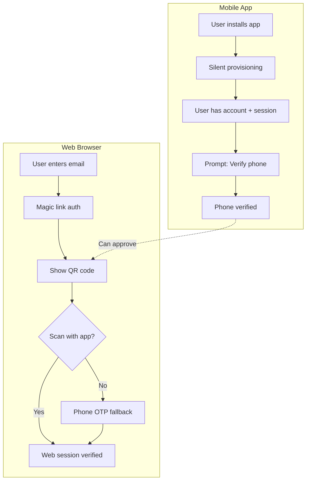
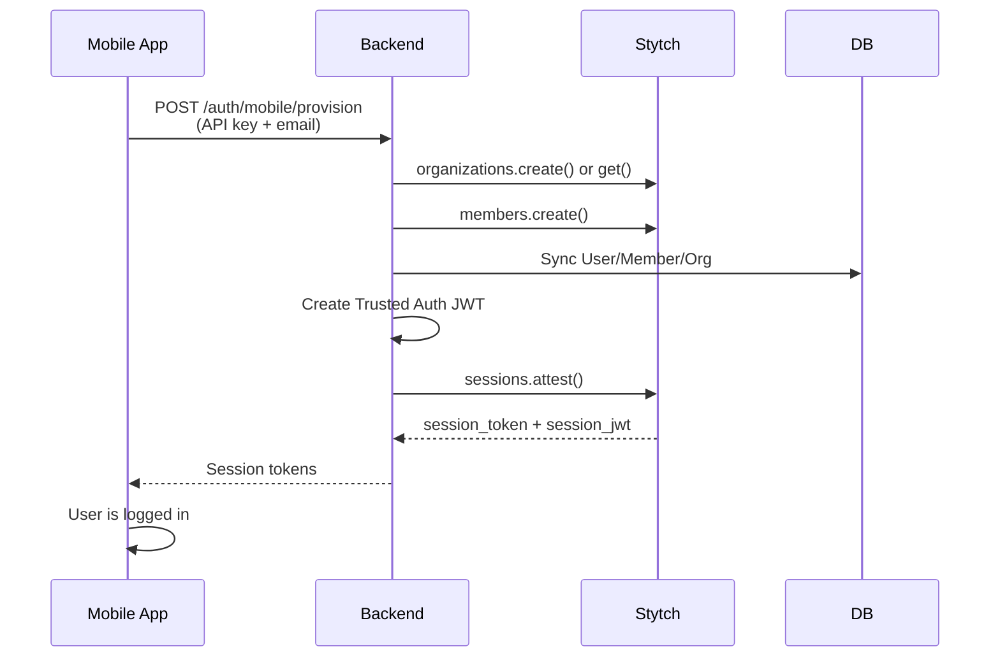
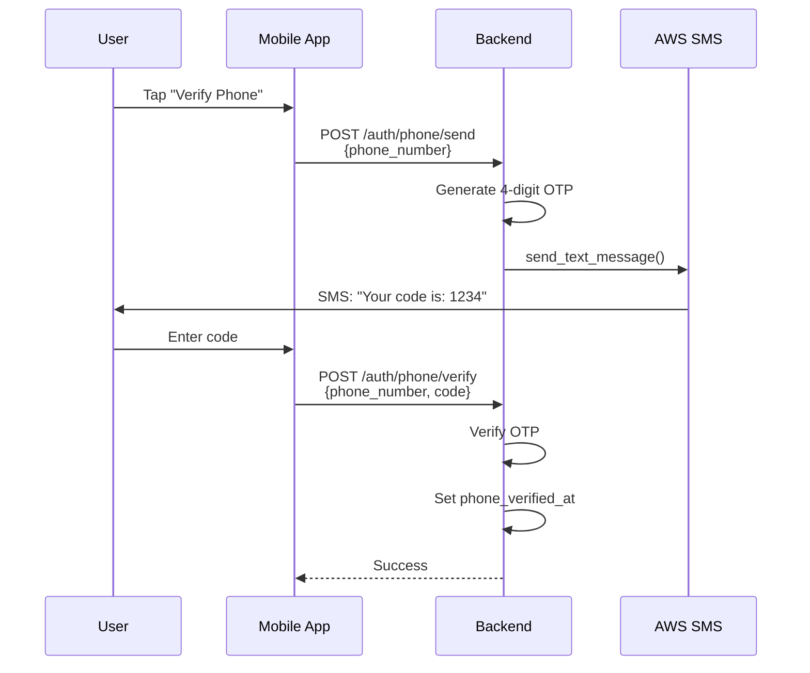
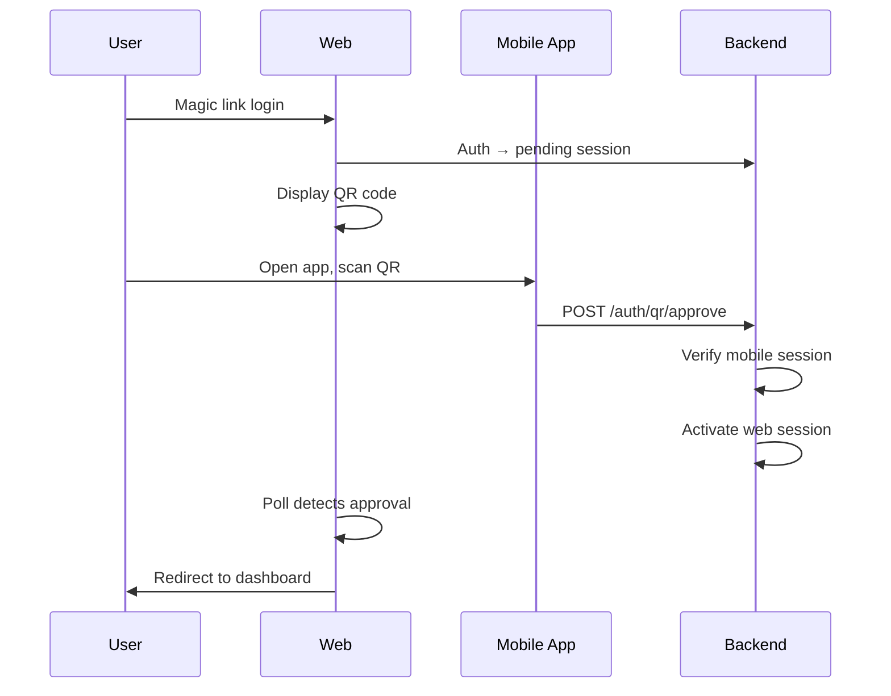
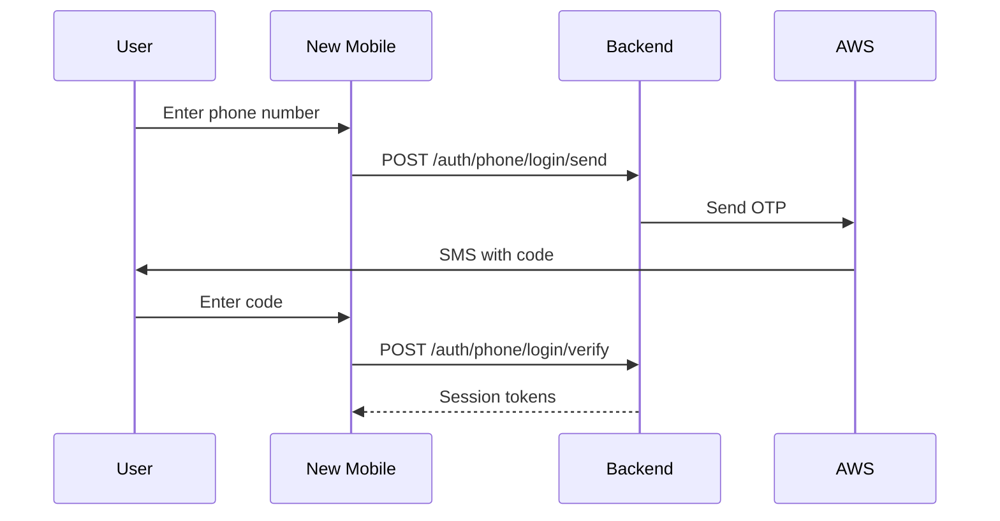

# Mobile Authentication

## Overview

Mobile authentication provides a seamless, headless authentication experience for native mobile apps:

- **Mobile Provisioning** — Silent account creation in the background
- **Phone Verification** — OTP-based phone number verification via AWS SMS
- **Phone Login** — Log into new devices using verified phone number
- **QR Web Verification** — Verify web logins by scanning QR code from mobile app

## Architecture



## Mobile Provisioning

Headless endpoint that creates user accounts without any user interaction. Uses Stytch's Trusted Auth to mint real sessions.

### Flow



### API

```http
POST /api/v1/auth/mobile/provision
X-Mobile-API-Key: <your-api-key>
Content-Type: application/json

{
  "email": "user@example.com",
  "name": "Jane Doe",
  "phone_number": "+14155551234",
  "organization_name": "Acme Corp",
  "organization_slug": "acme-corp"
}
```

**Response:**
```json
{
  "session_token": "stytch_session_xxx...",
  "session_jwt": "eyJhbGciOiJSUzI1NiI...",
  "member_id": "member-xxx",
  "organization_id": "organization-xxx"
}
```

### Request Options

| Field | Required | Description |
|-------|----------|-------------|
| `email` | Yes | User's email address |
| `name` | No | Display name |
| `phone_number` | No | Phone in E.164 format (stored unverified) |
| `organization_id` | Either | Join existing org |
| `organization_name` + `organization_slug` | Or | Create new org |

### Configuration

```env
MOBILE_PROVISION_API_KEY=your-secure-random-key-here
```

Generate a secure key:
```bash
openssl rand -base64 32
```

> **Security:** Protect this key carefully. Anyone with it can create accounts. Consider rotating periodically and using different keys per mobile app version.

---

## Phone Verification (OTP)

SMS-based phone verification using AWS End User Messaging. Independent of Stytch sessions to avoid "immutable session" limitations.

### Flow



### API Endpoints

#### Send OTP

```http
POST /api/v1/auth/phone/send
Authorization: Bearer <session_jwt>
Content-Type: application/json

{
  "phone_number": "+14155551234"
}
```

**Response:**
```json
{
  "success": true,
  "message": "Verification code sent to +14155551234",
  "expires_in_minutes": 30
}
```

#### Verify OTP

```http
POST /api/v1/auth/phone/verify
Authorization: Bearer <session_jwt>
Content-Type: application/json

{
  "phone_number": "+14155551234",
  "code": "1234"
}
```

**Response:**
```json
{
  "success": true,
  "message": "Phone number verified successfully",
  "phone_verified": true
}
```

### Error Handling

| Status | Error | Description |
|--------|-------|-------------|
| 429 | Rate limited | Max 3 OTPs per phone per hour |
| 400 | Invalid code | Wrong OTP (shows attempts remaining) |
| 400 | Expired | OTP expired (30 min default) |
| 400 | Max attempts | 5 wrong attempts, must request new code |

### Configuration

```env
# AWS Region for SMS service
AWS_SMS_REGION=us-east-1

# Phone number or Sender ID from AWS
AWS_SMS_ORIGINATION_IDENTITY=+12025551234

# OTP settings (optional, these are defaults)
AWS_SMS_OTP_LENGTH=4
AWS_SMS_OTP_EXPIRY_MINUTES=30
```

### AWS Setup

Phone verification requires AWS End User Messaging with 10DLC registration (US):

1. **Register Brand** — Company info, EIN, address
2. **Register Campaign** — Select "OTP/2FA" use case
3. **Wait for Approval** — 2-4 weeks typically
4. **Provision Number** — AWS assigns 10DLC number
5. **Configure** — Add number to `AWS_SMS_ORIGINATION_IDENTITY`

> **Timeline:** Start registration early. Brand/campaign approval runs in parallel with development.

### Security Features

| Feature | Implementation |
|---------|----------------|
| **Rate Limiting** | Max 3 OTPs per phone per hour |
| **Attempt Limiting** | Max 5 verification attempts per OTP |
| **Timing Attack Prevention** | Constant-time code comparison |
| **Expiration** | OTPs expire after 30 minutes |
| **Invalidation** | New OTP invalidates previous unused ones |

---

## Phone Number Model

After verification, phone is stored on the User:

```python
class User(models.Model):
    phone_number = models.CharField(max_length=20, blank=True)
    phone_verified_at = models.DateTimeField(null=True, blank=True)
```

- `phone_number` — E.164 format (e.g., `+14155551234`)
- `phone_verified_at` — Timestamp of verification (null = unverified)

Check verification status:
```python
user.phone_verified_at is not None  # True if verified
```

---

## OTP Data Model

```python
class OTPVerification(models.Model):
    user = models.ForeignKey(User, null=True)  # Null for login flow
    phone_number = models.CharField(max_length=20)
    code = models.CharField(max_length=10)
    purpose = models.CharField(choices=["phone_verify", "login"])

    is_verified = models.BooleanField(default=False)
    attempts = models.PositiveSmallIntegerField(default=0)
    max_attempts = models.PositiveSmallIntegerField(default=5)

    created_at = models.DateTimeField(auto_now_add=True)
    expires_at = models.DateTimeField()
    verified_at = models.DateTimeField(null=True)

    aws_message_id = models.CharField(blank=True)  # For tracking
```

### Cleanup

Expired OTPs older than 24 hours should be cleaned up periodically:

```python
from apps.sms.services import cleanup_expired_otps

# Call from a scheduled task (Celery beat, cron, etc.)
deleted_count = cleanup_expired_otps()
```

---

## Testing

### Local Development (No AWS)

For local testing without AWS, mock the SMS client:

```python
from unittest.mock import patch

with patch("apps.sms.services.send_otp_message") as mock_send:
    mock_send.return_value = {"message_id": "test-123", "success": True}
    # OTP is created but no SMS sent
```

### Test Coverage

The SMS app includes comprehensive tests:

```bash
# Run SMS tests
pytest tests/sms/ -v

# Run mobile provisioning tests
pytest tests/accounts/test_mobile_provision.py -v
```

| Test Category | Count |
|---------------|-------|
| OTP Services | 12 |
| OTP API | 12 |
| Schema Validation | 3 |
| Mobile Provisioning | 23 |
| **Total** | 50 |

---

## Future: QR Web Verification

> **Status:** Planned, not yet implemented

Web login verification via QR code scanning:



---

## Future: Phone Login

> **Status:** Planned, not yet implemented

Login to new mobile devices using verified phone number:



This requires the phone to be previously verified via the primary device.
