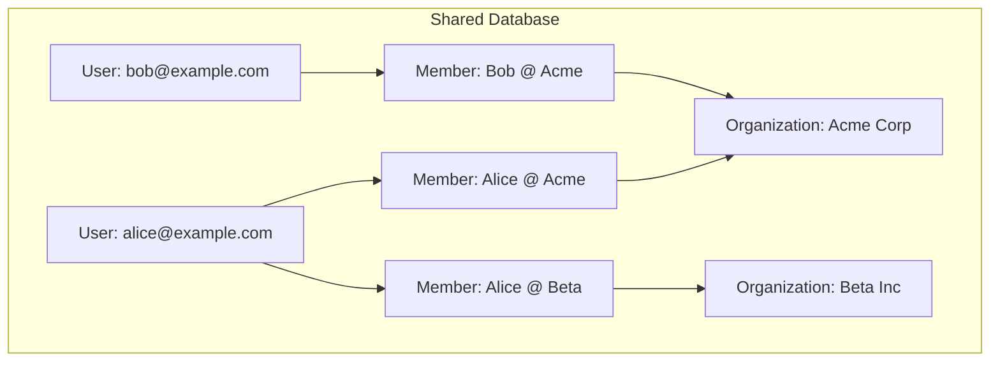
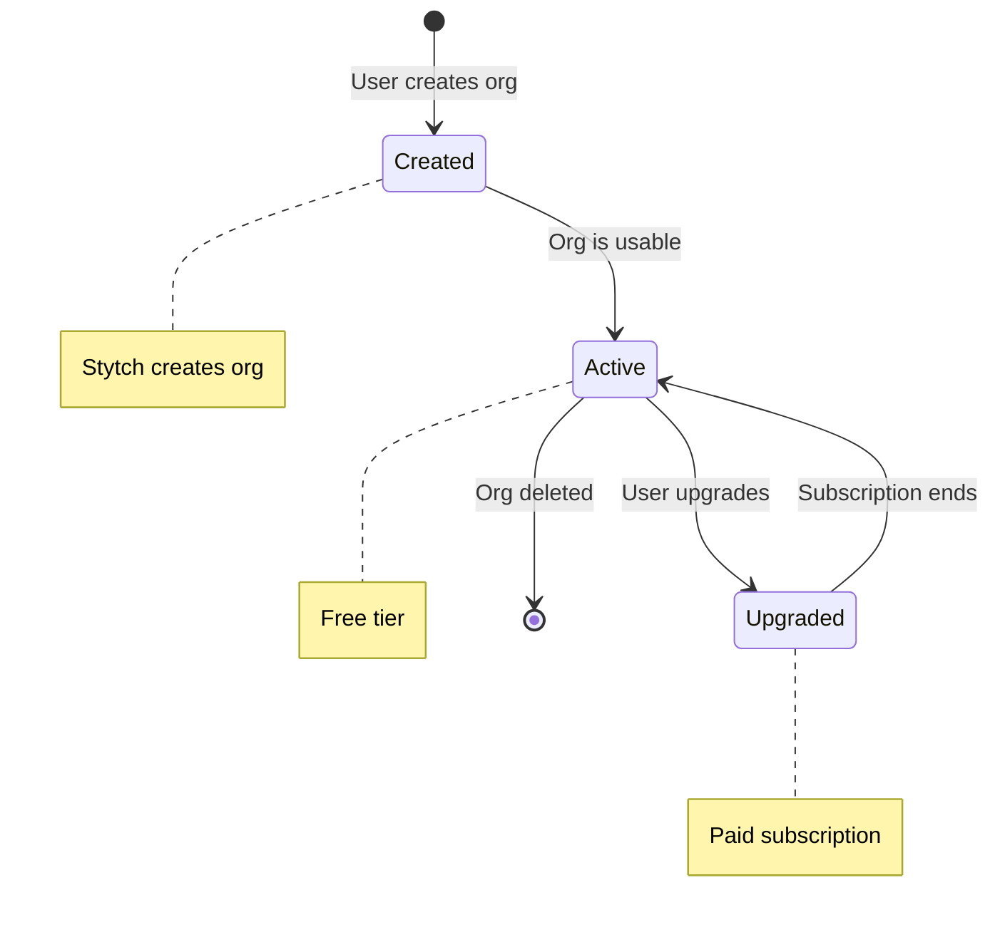

# Organizations & Multi-Tenancy

## Overview

The system implements **shared database multi-tenancy** where all organizations share the same database, with data isolation through foreign key relationships.

## Multi-Tenancy Model



## User Multi-Org Access

A single user (identified by email) can be a member of multiple organizations:

```mermaid
flowchart LR
    subgraph User
        email[alice@example.com]
    end
    
    subgraph Memberships
        M1[Admin @ Acme Corp]
        M2[Member @ Beta Inc]
        M3[Viewer @ Gamma LLC]
    end
    
    email --> M1
    email --> M2
    email --> M3
```

## Organization Lifecycle



## API Endpoints

### Get Organization
```
GET /api/v1/auth/organization
```
Returns current organization details including billing info.

**Requires:** Valid session JWT

**Response:**
```json
{
  "id": 1,
  "stytch_org_id": "organization-xxx",
  "name": "Acme Corp",
  "slug": "acme-corp",
  "billing": {
    "billing_email": "billing@acme.com",
    "billing_name": "Acme Corporation Inc.",
    "address": {
      "line1": "123 Main St",
      "city": "San Francisco",
      "country": "US"
    },
    "vat_id": ""
  }
}
```

### Update Organization
```
PATCH /api/v1/auth/organization
```
Updates organization name.

**Requires:** Admin role

**Request:**
```json
{ "name": "Acme Corporation" }
```

### Update Billing Info
```
PATCH /api/v1/auth/organization/billing
```
Updates billing address and VAT info. Syncs to Stripe.

**Requires:** Admin role

**Request:**
```json
{
  "billing_email": "invoices@acme.com",
  "billing_name": "Acme Corp Inc.",
  "address": {
    "line1": "456 Oak Ave",
    "city": "New York",
    "state": "NY",
    "postal_code": "10001",
    "country": "US"
  },
  "vat_id": "DE123456789"
}
```

## Member Management

### List Members
```
GET /api/v1/auth/organization/members
```
Returns all members of the current organization.

**Requires:** Valid session JWT

### Invite Member
```
POST /api/v1/auth/organization/members
```
Sends an invitation email to join the organization.

**Requires:** Admin role

**Request:**
```json
{
  "email": "newuser@example.com",
  "role": "member"
}
```

### Update Member Role
```
PATCH /api/v1/auth/organization/members/{member_id}
```
Changes a member's role.

**Requires:** Admin role

### Delete Member
```
DELETE /api/v1/auth/organization/members/{member_id}
```
Removes a member from the organization.

**Requires:** Admin role

## Data Isolation

All queries are scoped to the current organization:

```python
# In service layer
def get_resources(org: Organization):
    return Resource.objects.filter(organization=org)

# In endpoint
@router.get("/resources")
def list_resources(request):
    org = request.auth_organization
    return get_resources(org)
```

## Stytch Sync

Organization data syncs from Stytch:

| Stytch Field | Django Field |
|--------------|--------------|
| `organization_id` | `stytch_org_id` |
| `organization_name` | `name` |
| `organization_slug` | `slug` |

**Local Extensions:**
- Billing information
- Stripe customer ID
- Any app-specific settings
