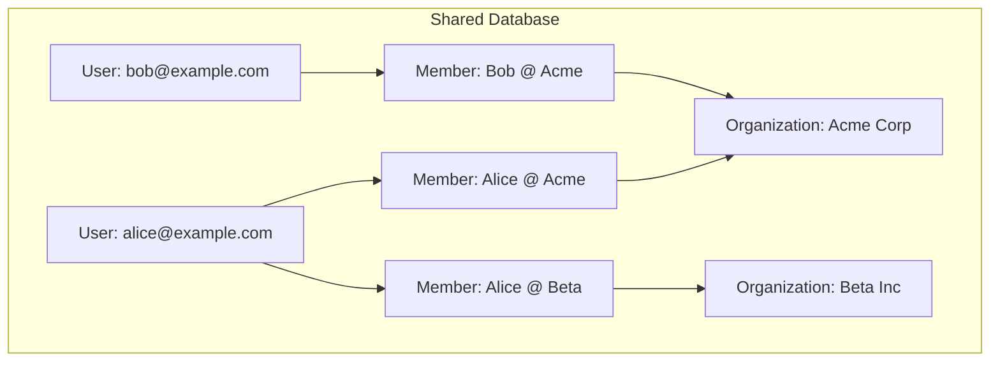
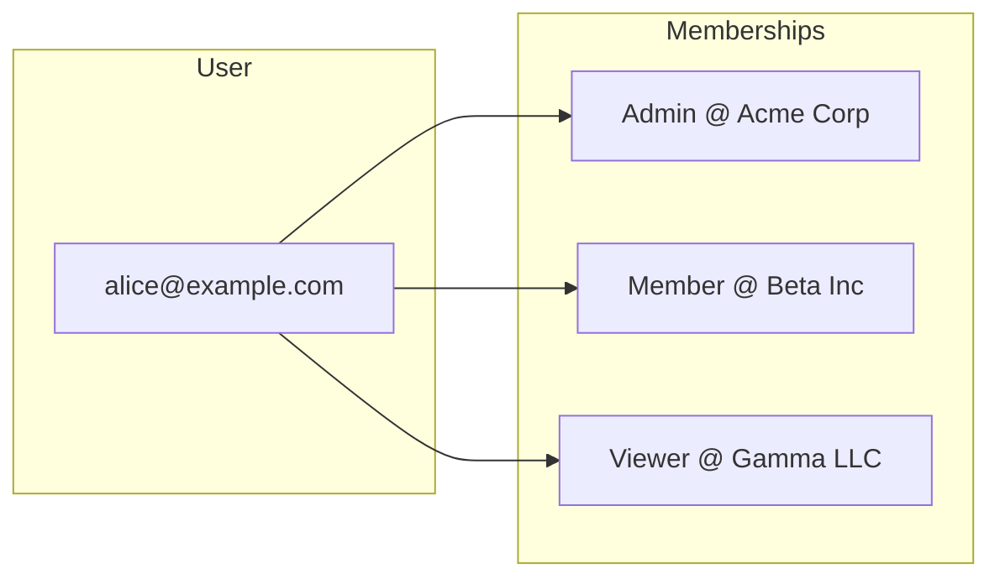
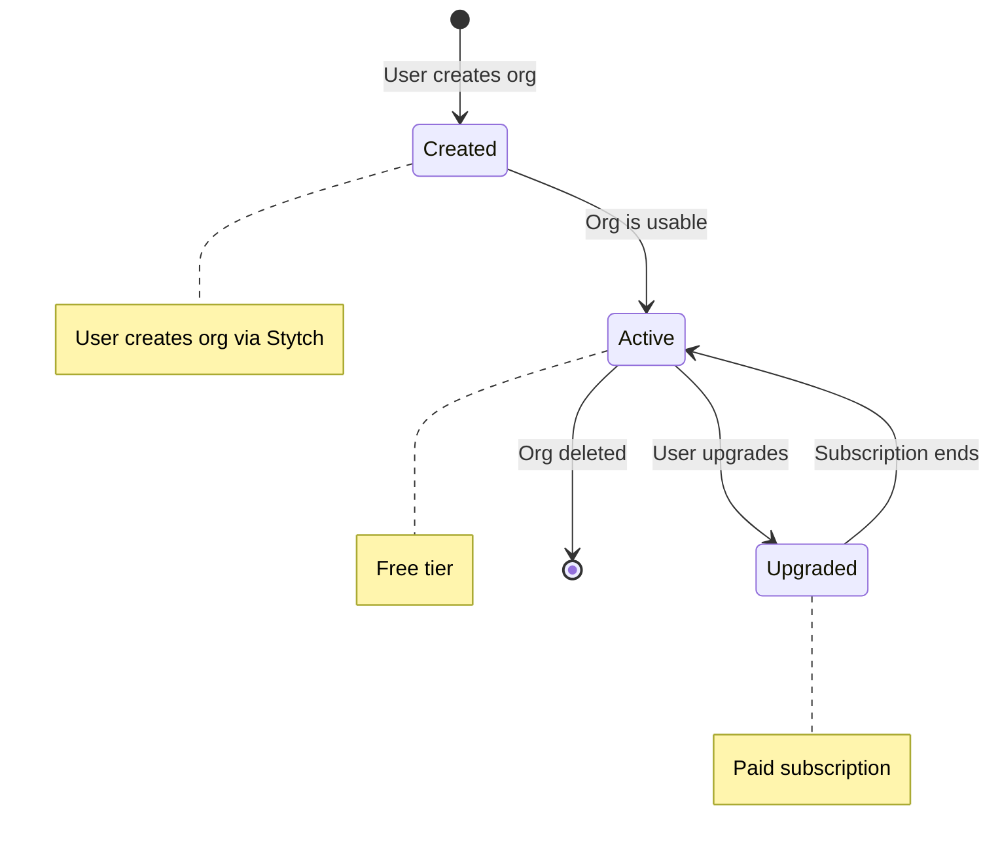

# Organizations & Multi-Tenancy

## Overview

The system implements **shared database multi-tenancy** where all organizations share the same database, with data isolation through foreign key relationships.

## Multi-Tenancy Model



## User Multi-Org Access

A single user (identified by email) can be a member of multiple organizations with different roles:



## Organization Lifecycle



## Data Isolation

All queries are scoped to the authenticated member's organization:

```python
def get_resources(org: Organization):
    return Resource.objects.filter(organization=org)
```

## Stytch Sync

Organization data syncs from Stytch:

| Stytch Field | Django Field |
|--------------|--------------|
| `organization_id` | `stytch_org_id` |
| `organization_name` | `name` |
| `organization_slug` | `slug` |

**Local Extensions** (not in Stytch):
- Billing address and VAT info
- Stripe customer ID
- App-specific settings
